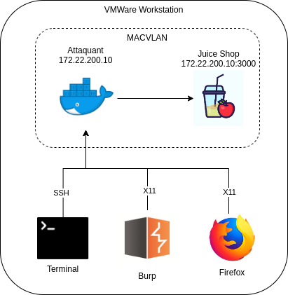
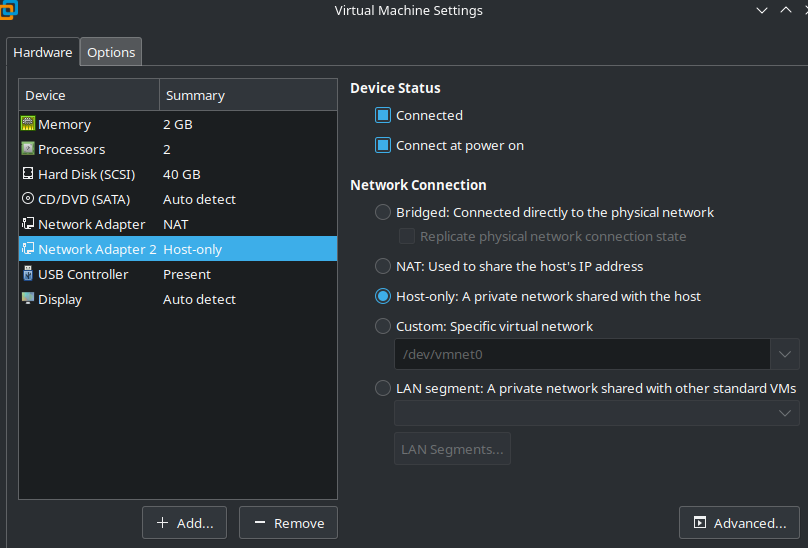
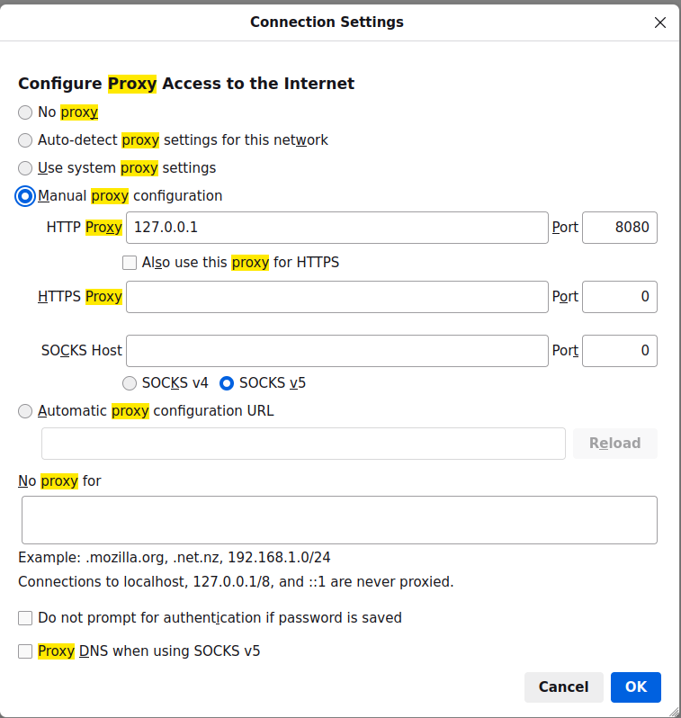

# Exercice OWASP Juice Shop

## Introduction

Dans le cadre du cours EHK 2024, il vous est demandé de mettre en place de compétences de Ethical Hacking sur la plateforme `Juice-Shop`.
Cette plateforme permet de s'attaquer à une grande quantité de challenge web dans le but de d'identifier et attaquer différents type de vulnérabilités.

Afin de pouvoir évaluer votre travail, nous avons mis en place la solution labtainer qui permet d'analyser les actions que vous avez effectuées. Normalement, cette solution peut être déployée sur un serveur distant, mais dans le cadre de cet exercice, vous devrez l'installer vous même localement. 

## Labtainer

Cet exercice a besoin d'une infrastructure assez complexe.



Lors ce que vous aurez installer labtainer et lancé l'exercice, votre infrastructure ressemblera à celle illustrée dans le schéma.

Vous aurez accès un terminal connecté à SSH, et aurez la possibilité de lancer Firefox et Burp sur le protocol X11, et donc vous aurez les outils nécessaires afin d'attaquer les objectifs de ce laboratoire.

## Installation

Pour effectuer ce laboratoire, vous devrez mettre en place la solution Labtainer et configurer certains paramètres.

1. **Téléchargement de Labtainers** :
   - Rendez-vous sur le site officiel de Labtainers à [https://nps.edu/web/c3o/labtainers](https://nps.edu/web/c3o/labtainers).
   - Suivez les instructions pour télécharger la dernière VM de Labtainers.
   - Nous vous recommandons d'installer Labtainers via VMware Workstation, car c'est l'environnement que nous avons utilisé pour créer cet exercice.

## Configuration de l'environnement

1. **Lancement de la machine virtuelle** :
   - (Optionnel) Augmentez les ressources votre machine virtuelle à 16 coeur (ou moins) et 4GB de RAM.
   - Lancer WMWare workstation et lancer la machine virtuelle que vous venez de télécharger.
   - Il se peut que lors du lancement de celle-ci, un mot de passe vous soit demandé, et celui-ci est `password123`.

2. **Copie du laboratoire** : 
   - Pour devrez copier le laboratoire afin de le rendre disponible dans la liste des laboratoires préalablement disponible.
   - Pour ce faire, déposez de tous les fichiers et dossiers du répertoire `./web_lab/` depuis votre système hôte vers le répertoire `/home/student/labtainer/trunk/labs/web_lab` dans la machine virtuelle pour les copier.

3. **Remplacement des scripts personnalisés** :
   - Pour devrez modifier certains scripts pour faire fonctionner ce laboratoire.
   - Pour ce faire, accédez au répertoire `./custom_script` où les scripts personnalisés sont fournis.
   - Faites un glisser-déposer de ce répertoire depuis votre système hôte vers le répertoire `/home/student/labtainer/labtainer-student/bin` dans la machine virtuelle pour les remplacer.

4. **Ajout et configuration de la carte réseau** :
   - Dans VMware Workstation, accédez aux paramètres de la machine virtuelle en cliquant sur "VM > Settings".
   - Cliquez sur "Add" pour ajouter une nouvelle carte réseau.
   - Sélectionnez "Network Adapter" et cliquez sur "Finish".

   

   - Maintenant, sélectionnez la nouvelle carte réseau ajoutée et assurez-vous qu'elle est configurée en mode "Host-only".

5. **Modification de la carte en mode promiscuous** :
   - Dans la machine virtuelle, ouvrez un terminal.
   - Exécutez les commandes suivantes pour configurer la carte réseau en mode promiscuous :
     ```
     sudo ifconfig ens36 0.0.0.0
     sudo ifconfig ens36 promisc
     ```

6. **Lancement du laboratoire**:
   - Exécutez la commande suivante pour lancer le laboratoire dans le :
     ```
     labtainer web_lab
     ```
     Cette commande va lancer votre laboratoire. Référencez vous à la section "Résolution de problème" de ce document si cette commande ne fonctionne pas.

7. **Lancement des outils**
   - Dans le nouveau terminal `ubuntu@attacker: ~`, vous aurez accès aux différents outils nécessaires pour ce laboratoire.
     ```
     # Lancez firefox en arrière-plan
     firefox & 
     # Executez burp
     java -jar burpsuite_community.jar
     ```

8. **Configuration de firefox**
   La version de `Juice Shop` utilisée dans ce laboratoire importe des dépendances `js` depuis internet, mais le réseau que vous venez de générer ne dispose pas de connexion vers l'extérieur. Il vous est donc nécessaire de :
   - Dans la barre de recherche du navigateur que vous venez d'ouvrir, cherchez `about:config`.
   - Acceptez le risque et continuez.
   - Cherchez `network.dns.disabled` et changez sa configuration à `true`. Appliquez les modifications.

9.  **Accéder à `Juice Shop`**
   - Entrez l'URL `http://172.22.200.10:3000` pour accéder à `Juice Shop`. 

10. **Arrêter le laboratoire**
   - Lorsque vous avez terminez le laboratoire ou bien mettez en pause votre travail, il vous sera nécessaire d'arrêter le laboratoire, afin de sauvegarder votre travail.
   - Pour ce faire, il est nécessaire de lancer la commande `stoplab web_lab` à l'emplacement `/home/student/labtainer/labtainer-student`.
   - Notez que si vous mettez votre machine virtuelle en `Suspend`, vous n'aurez pas besoin d'interrompre votre laboratoire.
  
## Intercepter un paquet avec Burp

Burp propose un proxy qui permet d'intercepter le trafic http entre le navigateur et juice shop. Pour l'utiliser, il vous faudra configurer votre navigateur pour qu'il passe par ce proxy. Par exemple, pour firefox, le règlage se trouve dans `Settings > Network settings`



En suite, vous devrez aller dans Burp et dans `Proxy`, il vous sera nécessaire d'activer l'intercepteur en changeant `Intercept is off` à `Intercept is on`. A partir de ce moment, Burp interceptera toute les communications entre votre navigateur et le service `Juice shop`. Vous pourrez alors les envoyer au `Repeater`.

Désactiver l'intercepteur dans Burp permet aux requêtes http de passer sans être intérrompues. Cependant, lorsque que vous quittez Burp, il est indispensable de désactiver le proxy dans votre navigateur firefox. 

## Tâches à effectuer

### Warmup - Mauvaise validation d’inputs

En visitant le shop, vous ne l'aimez pas du tout, vous décidez donc le de faire savoir en postant un feedback.

1. **Trouvez un moyen de poster un feedback avec une note de 0 étoile.**
   
2. **Quel est le problème dans l'implémentation du système de feedback ?**
   
3. **Trouvez un moyen de vous créer un compte admin** : Pour cette étape il est peut-être utile d'obtenir le schéma de la base de donnée que vous
récupérerez dans la partie suivante !

4. **Quel est le problème dans cet appel à l'API ?**

### Injection - Schéma de la base de donnée

Dans cette partie on souhaite récupérer le schéma de la base de donnée pour ensuite pouvoir "crafter" d'autres requêtes SQL pour récupérer des données.

5. **Quel est le point d'entrée pour injecter du SQL** ?
   
6. **Quel est le moteur de la base de donnée** ?
   
7. **Quelle est la requête utilisée de base pour récupérer un produit** ?
   
8. **En fonction du moteur de la base de donnée, existe-t-il des fonctions spécifiques pour récupérer le schéma de la base de donnée ? Ou existe-t-il une table contenant par exemple le script de création de la base de donnée ?**
   
9. **Trouvez un moyen de récupérer le schéma de la base de donnée.** : *Hint: UNION SELECT '1', '2', '3', ..... –*

### Récupération du compte admin

Maintenant que nous avons une bonne idée de la structure de la base de donnée, nous allons pouvoir récupérer des informations précises, tel que des comptes utilisateurs, notamment celui de l'administrateur. 

On peut réutiliser le même point d'entrée que précédemment.

10. **Trouvez un moyen de récupérer le compte admin.**
    
11. **Quel est le mot de passe de l'administrateur ?**

### JWT

Pour cette section Burpsuite propose des plugins pour manipuler les JWT (JWT Editor et/ou JSON Web Tokens), sinon vous pouvez utiliser jwt.io.
En vous connectant avec votre nouveau compte admin, vous remarquez que le site utilise des JWT pour gérer les sessions.

12. **Quel est l'algorithme utilisé pour signer les JWT ?**
    
13. **Trouvez un moyen de vous connecter en tant que "jwtn3d@juice-sh.op" sans connaitre son mot de passe.**
    
14. **Montrez le payload du JWT utilisé En utilisant DirBuster**. Vous trouvez un endpoint (/encryptionkeys) qui vous permet de récupérer des informations intéressantes.
    
15. **Montrez que vous êtes capable de vous connecter en tant que "rsa_lord@juice-sh.op" en forgeant un nouveau JWT.** *Hint : https://portswigger.net/web-security/jwt/algorithm-confusion*
    
16. **Pourquoi êtes-vous capable de forger ce JWT, quel est le problème d'implémentation coté serveur ?**

## Résolution de problèmes 

### Problèmes avec MACVLAN

Si vous rencontrez un problème similaire à celui-ci :

```
ip : 172.17.0.1 iface : docker0 count : 1
ip : 172.16.233.129 iface : ens33 count : 2
ip : None iface : ens36 count : 3
ip : 127.0.0.1 iface : lo count : 4
[2023-09-20 01:45:19,592 - ERROR : ParseStartConfig.py:318 - finalize() ] MACVLAN requested, but not 1 unassigned interfaces
``````

Suivez ces étapes de résolution :

1. Assurez-vous d'avoir créé correctement la carte réseau et d'avoir appliqué les commandes de configuration.

2. Vérifiez que la troisième carte réseau affichée correspond bien à `ens36`. Si ce n'est pas le cas, modifiez la configuration du laboratoire en utilisant la commande suivante :

   ```
   NETWORK EXT_VMS
       MASK 172.22.0.0/16
       GATEWAY 172.22.0.1
       MACVLAN_EXT 3 # MODIFIER AVEC LA VALEUR CORRECTE
   ```

### Autres problèmes

Si vous rencontrez d'autres problèmes, veuillez contacter l'assistant de cours ou le professeur responsable pour obtenir de l'aide supplémentaire.
